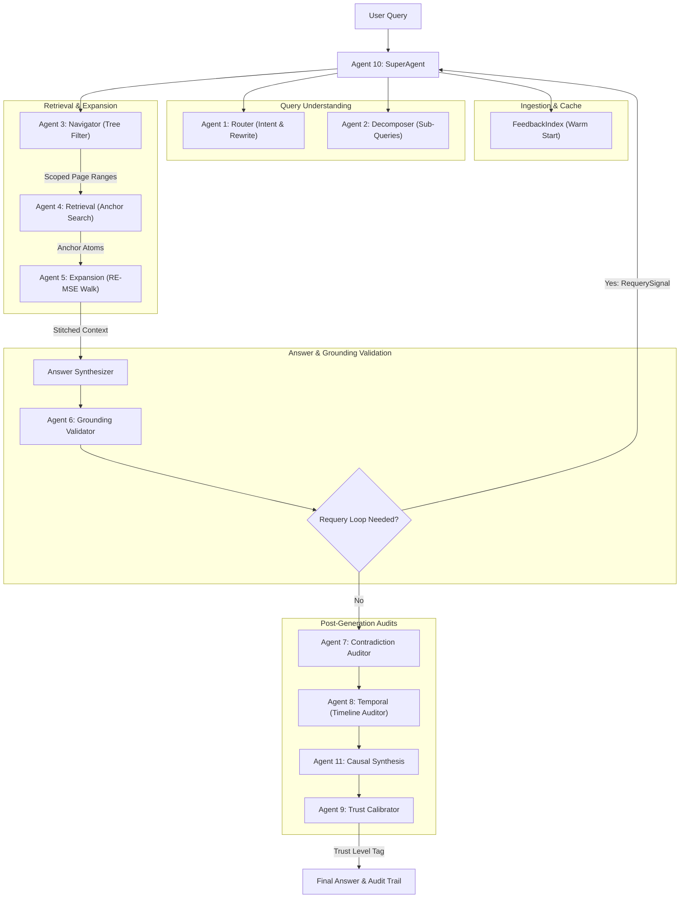

# Vasis AI: PageIndex-RE-MSE CRDB Hybrid RAG Engine

A production-ready, highly secure, **100% offline local RAG system** combining macro-level document tree navigation, micro-level atomic text reconstruction, and an **autonomous 14-Agent Contextual Reconstruction Database (CRDB)** orchestration engine.

The system is fully self-contained, requiring zero external APIs, keys, or cloud dependencies, and runs entirely locally via **Ollama**.

---

## SYSTEM FEATURES & CAPABILITIES 

*   **Vectorless RAG Architecture:** Replaces traditional vector embeddings and flat chunking with a dual-layer index that preserves document hierarchy and sequence.
*   **Dual-Model Orchestration Swarm:** Dynamically routes tasks between lightweight agentic models (`qwen2.5-coder:3b` for fast, structured planning and parsing) and deep reasoning models (`deepseek-llm:7b` for qualitative synthesis and grounding audits).
*   **RE-MSE Progressive Context Reconstruction:** Walks sentence-level sequence nodes bidirectionally to stitch seamless, gap-free reading contexts.
*   **Self-Healing JSON Hardening:** Employs Ollama token grammar schemas and a regex-based healing parser to ensure 100% stable execution.
*   **Automatic Output Ingestion:** Automatically saves generated papers and implementation guides into clean markdown formats under `outputs/` with timestamped, query-derived filenames.
*   **Interactive Control Panel:** Clickable Windows Batch Control Panel (`start_system.bat`) to launch servers, run benchmarks, open chat clients, and monitor VRAM.
*   **Advanced Terminal Interfaces:** Includes a styled, autocomplete-enabled Interactive CLI Shell (`vasis_cli.py`) and a full-screen, asynchronous Textual Terminal User Interface (TUI, `vasis_shell.py`) for comprehensive RAG querying, agent inspection, and multi-document vault operations.

---

## KEY TECHNOLOGIES USED 

### 1. Model Orchestration & Local LLM Host
*   **Ollama (Local Server @ Port 11435):** Offline inference gateway running open-weights LLMs with hardware acceleration.
*   **Agentic Model (`qwen2.5-coder:3b`):** Optimized for structured planning, schema compliance, tree routing, and parsing.
*   **Reasoning Model (`deepseek-llm:7b`):** Routed dynamically for natural language audit critiques, contradictions, and final answer generation.

### 2. Micro & Macro Indexing Layer
*   **PageIndex Tree Builder:** Builds a macro-level logical tree representing section summaries, topics, and page boundaries (avoiding semantic drift).
*   **`AtomStore`:** An in-memory, doubly-linked data store containing 50-100 token text segments (atoms) with sequential pointers.
*   **`BM25Index`:** A high-precision keyword retrieval index scoped explicitly within PageIndex-validated nodes to eliminate irrelevant pages.
*   **`TripleStore` & `CausalStore`:** Extract semantic Subject-Relation-Object knowledge triples and form causal reasoning graphs for multi-hop link traversal.

### 3. Software Stack & Core Libraries
*   **Python 3.9+ / 3.11:** Core runtime.
*   **PyMuPDF (`fitz`):** Ultra-fast local PDF processing and text extraction.
*   **FastAPI & Uvicorn (`api.py`):** REST API endpoints supporting frontend and control panel integrations.
*   **Rich CLI Dashboard, Autocomplete Shell, & Textual TUI:** Provides advanced visual terminal panels (`rich`), an autocomplete-enabled interactive command line interface (`prompt_toolkit`), a full-screen asynchronous terminal dashboard (`textual`), and real-time agent routing visualization.

---

## THE 14-AGENT CRDB SWARM ORCHESTRATION 
At the heart of the system is the **Contextual Reconstruction Database (CRDB)**, managed by an autonomous multi-agent swarm:



### Agent Directory & Workflow Roles
1.  **Agent 1: Router** — Identifies intent, normalizes terminology, and classifies bibliography targets.
2.  **Agent 2: Decomposer** — Splits multi-part questions into atomic sub-queries.
3.  **Agent 3: Navigator** — Scopes search ranges top-down via the PageIndex summary tree.
4.  **Agent 4: Retrieval Agent** — Fetches primary "anchor" atoms from scoped candidate ranges.
5.  **Agent 5: Stateful Expander** — Walks the doubly-linked `AtomStore` bidirectionally to stitch gaps.
6.  **Agent 6: Grounding Validator** — Compares output against retrieved atoms; triggers the **Requery Loop** on failure.
7.  **Agent 7: Contradiction Auditor** — Scans the generated text against triples to isolate factual conflicts.
8.  **Agent 8: Temporal Agent** — Analyzes chronological timeline consistency.
9.  **Agent 9: Trust Calibrator** — Compares grounding, gaps, and conflicts using a mathematical deduction matrix to calculate overall trust.
10. **Agent 10: SuperAgent** — Central orchestrator, planner, dynamic agent scheduler, and quality reviewer.
11. **Agent 11: Causal Synthesizer** — Traverses causal graph triples to extract multi-hop inference links.
12. **Agent 12: Web Search** — Fallback external search agent (activated for paper writing and implementation guides).
13. **Agent 13: Paper Writer** — Autonomous drafting agent for formatted, objective scientific articles.
14. **Agent 14: Implementation Guide** — Autonomous drafting agent for detailed step-by-step developer manuals.

---

## CORE SYSTEM INNOVATIONS 

Detailed documentation of our architectural innovations can be found in [innovation.md](file:///e:/Vasis%20AI/innovation.md):
1.  **RE-MSE Progressive Expansion:** Eliminates context gaps by statefully growing retrieval regions around key facts.
2.  **Tree-Summary Navigation:** Prevents global semantic drift by scoping search pages before parsing raw text.
3.  **Cooperative Dual-Model Review Loop:** Decouples reasoning (`DeepSeek-7B`) from structured extraction (`Qwen-Coder-3B`) for crash-free JSON parsing.
4.  **Causal Traversal Knowledge Graph:** Traces multi-hop relationships across separated chapters.
5.  **Calibrated Trust Level Tagging:** Defensive confidence scoring (High/Medium/Low) using a penalty matrix (gaps, conflicts, requery cycles).
6.  **Bibliography Bypass Fast-Path:** Targets terminal citation nodes directly, bypassing BM25 matching.
7.  **Adaptive Paragraph Atomization:** Adjusts chunk borders dynamically based on layouts instead of double-newlines.

---

## INSTALLATION & QUICK START 

### Prerequisites
*   Install [Ollama](https://ollama.ai)
*   Pull the required models:
    ```bash
    ollama pull qwen2.5-coder:3b
    ollama pull deepseek-llm:7b
    ```

### Local Setup
1.  Clone the repository and navigate to the directory:
    ```bash
    cd "Vasis AI"
    ```
2.  Create and activate a virtual environment, then install dependencies:
    ```bash
    python -m venv .venv
    # Windows:
    .venv\Scripts\activate
    # Linux/Mac:
    source .venv/bin/activate
    
    pip install -r requirements.txt
    ```

### Running Commands & Interactive Clients

#### 🖥️ Interactive Terminal Interfaces
*   **Launch the Interactive CLI Shell (Rich + Autocomplete):**
    ```bash
    python vasis_cli.py
    ```
    *(Or run via `start_system.bat` option `1`)*. The shell supports autocomplete for commands, venues, levels, and local vault documents.
*   **Launch the Full-Screen Textual TUI (Textual + Rich):**
    ```bash
    python vasis_shell.py [optional_path_to_pdf.pdf]
    ```
    *(See the detailed keyboard shortcut and command reference in [TUI.md](file:///e:/Vasis%20AI/TUI.md))*. It features asynchronous task processing (`@work`), thread-safe UI updates, a live agent activation sidebar, and a vault visualizer.

#### ⚙️ Single-Line CLI Commands
*   **Index a PDF Document:**
    ```bash
    python main.py index uploads/your_document.pdf
    ```
*   **Ask a Single Fact-check Question:**
    ```bash
    python main.py ask uploads/your_document.pdf "What are the core metrics of this system?"
    ```
*   **Launch Interactive Swarm Chat CLI (Legacy):**
    ```bash
    python main.py chat uploads/your_document.pdf
    ```
*   **Start Backend REST API Server:**
    ```bash
    python api.py
    ```

### Windows Control Panel Launcher
Double-click [start_system.bat](file:///e:/Vasis%20AI/start_system.bat) in Windows Explorer to open the interactive dashboard. You can start the Interactive CLI Shell, run benchmark validations, index new documents, launch the API backend, and monitor local VRAM health directly from this dashboard.

---

## DIAGNOSTIC BENCHMARKS & EVALUATION 

The system includes a dedicated, ASCII-safe RAG evaluation suite to verify **factual recall**, **precision accuracy**, and **hallucination rejection** under offline conditions.

```bash
python tests/run_benchmarks.py
```

This sequentially tests:
1.  **Factual accuracy** against target values (e.g. verifying exact key dimensions like $d_k=64$).
2.  **Hallucination safety** via out-of-scope negative controls (forcing the grounding and calibration agents to reject quantum computing queries in standard transformer papers).
3.  **Multi-Hop Traversal recall** across adjacent document sections.
4.  **Bibliography retrieval validation** verifying last-page extraction.
