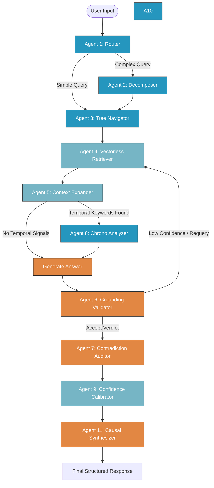

# PageIndex-RE-MSE Multi-Agent Architecture
**Active Model & Agent Topology Map**

The **PageIndex-RE-MSE** engine utilizes a dual-model, 11-agent local RAG architecture. Each component is statically or dynamically routed to the model best suited for its specific workload (logical constraint vs. reasoning depth).

---

## ─── 1. CORE MODELS IN USE ────────────────────────────────────────

| Model Identifier | Parameter Size | Primary Purpose | Key Operational Strength |
| :--- | :--- | :--- | :--- |
| **`qwen2.5-coder:3b`** | $3.0\text{B}$ | Agentic Work, Planning, and Structuring | Superior JSON compliance under native schema constraints, zero grammar errors. |
| **`deepseek-llm:7b`** | $7.0\text{B}$ | Reasoning, Grounding, and Factual Synthesis | High context-synthesis accuracy, deep logical contradiction analysis. |

---

## ─── 2. ACTIVE AGENT MODEL ROUTING ─────────────────────────────────

### A. Agentic & Structured Work (Qwen 2.5 Coder 3B)
These agents require rigid JSON schemas, speed, and logical constraint enforcement.

| Agent Identifier | Operational Role | Output Type |
| :--- | :--- | :--- |
| **`agent1_router`** | Intent classification and query rewrites | Structured JSON |
| **`agent2_decomposer`** | Sub-query decomposition for complex inputs | JSON array of strings |
| **`agent3_navigator`** | Page-summary tree selection and scoring | Structured JSON |
| **`agent8_temporal`** | Chronology and timeline extraction | Structured JSON |
| **`agent10_super`** | Master Orchestrator planning & reviews | Structured JSON |
| **`tree_builder`** | Index builder (creates hierarchical tree summaries) | Structured JSON |
| **`triple_extractor`** | KG builder (extracts knowledge triples) | Structured JSON |

---

### B. Reasoning & Synthesis Work (DeepSeek LLM 7B)
These agents handle open-ended reasoning, deep validation checks, and narrative answers.

| Agent Identifier | Operational Role | Output Type |
| :--- | :--- | :--- |
| **`agent6_validation`** | Grounding verification of claims vs. narrative | Structured JSON |
| **`agent7_contradiction`** | Scan narrative for cross-doc or logical conflicts | Structured JSON |
| **`agent11_synthesis`** | Indirect multi-hop causal chain synthesis | Structured JSON |
| **`answer_generation`** | Context-grounded final answer generation | Raw Markdown / Text |
| **`tutor`** / **`novelty`** | User-facing follow-ups and novelty assessments | Raw Markdown / Text |

---

### C. Pure Python Agents (No LLM Overhead)
These components are implemented as high-performance database-query, heuristic-matching, or graph-traversal scripts.

| Component Name | Technical Implementation | Operational Role |
| :--- | :--- | :--- |
| **`agent4_retrieval`** | Vectorless database hybrid retrieval | Gathers anchor segment atoms using BM25 and semantic triple matches. |
| **`agent5_expansion`** | Graph-based Adaptive Stopping RE-MSE traversal | Reconstructs document context sequentially without gaps. |
| **`agent9_calibration`** | Weighted mathematical model | Calculates logical confidence and trust level tags based on penalties. |

---

### D. Cooperative Dual-Model Workflow (Orchestrator Reviews)
To achieve both deep critical analysis and reliable JSON syntax output, the **Orchestrator Quality Review loop** (`_review` inside `agent10_super`) operates as a cooperative dual-model pipeline:

```
                  ┌──────────────────────┐
                  │ Agent Output to Review│
                  └──────────┬───────────┘
                             │
                             ▼  (Phase 1: Reasoning)
                  ┌──────────────────────┐
                  │   DeepSeek LLM 7B    ├─► Generates raw narrative assessment
                  └──────────┬───────────┘
                             │
                             ▼  (Phase 2: Parsing)
                  ┌──────────────────────┐
                  │  Qwen 2.5 Coder 3B   ├─► Extracts scores & lists into JSON
                  └──────────┬───────────┘
                             │
                             ▼
                  ┌──────────────────────┐
                  │ Structured JSON Dict │
                  └──────────────────────┘
```

1. **Phase 1: Qualitative Evaluation (DeepSeek-7B):** Generates an open-ended narrative quality analysis (accuracy, gaps, expected outcomes) in natural language. This keeps DeepSeek unconstrained by JSON schema limits and permits deeper cognitive reasoning.
2. **Phase 2: Structural JSON Extraction (Qwen-3B-Coder):** Takes the raw DeepSeek evaluation text and parses it under strict Ollama `format="json"` constraints, transforming it into a strict structured dict conforming to the system’s execution loop schemas.

---

## ─── 3. EXECUTION PIPELINE VISUALIZATION ────────────────────────────


