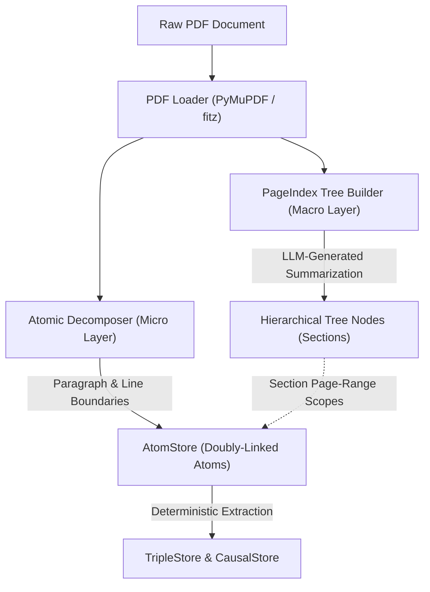
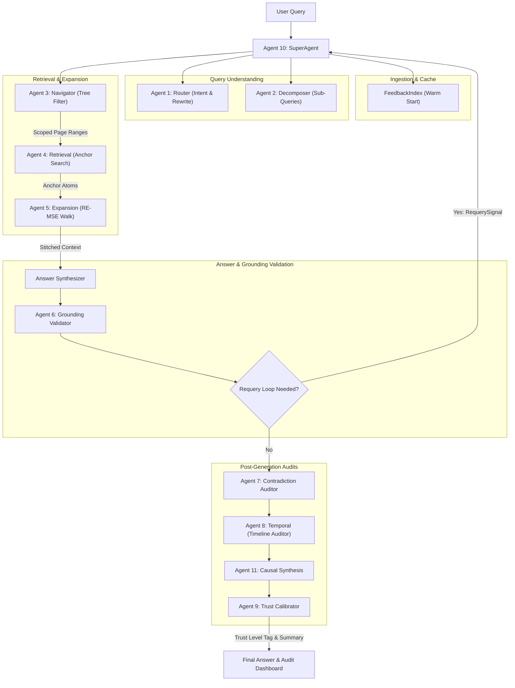

# PageIndex-RE-MSE CRDB: System Architecture

The **PageIndex-RE-MSE Contextual Reconstruction Database (CRDB)** is a production-ready, highly secure, **100% offline local RAG (Retrieval-Augmented Generation)** engine. By avoiding traditional single-pass vector database retrieval and cloud dependencies, it resolves typical RAG failure modes like context fragmentation, semantic drift, loss of document structure, and hallucinated responses on out-of-scope queries.

The architecture runs entirely locally via **Ollama**, orchestrating two specialized models:
- **Agentic Model (`qwen2.5-coder:3b`):** Optimized for high-speed instruction following, sub-query decomposition, tree navigation, and strict JSON parsing.
- **Reasoning Model (`deepseek-llm:7b`):** Optimized for natural language logic, factual synthesis, contradiction checking, and grounding verification audits.

---

## ─── DUAL-LAYER VECTORLESS INDEXING LAYER ──────────────────────────

Rather than slicing the document into arbitrary flat text chunks and converting them into vector embeddings, the system implements a **Dual-Layer Indexing Layer** that preserves both macro-level document hierarchy and micro-level factual detail.



### 1. The Macro Layer: Hierarchical Page-Summary Navigation Tree
Implemented in [tree_builder.py](file:///e:/Vasis%20AI/ingest/tree_builder.py), this layer models the high-level layout of the document.
* **Extraction Strategy:** Scans pages for Markdown headers (`#`, `##`). If enough headings are found, it partitions the pages at these natural boundaries; otherwise, it dynamically calculates an adaptive page-group size based on the document length (usually 3 to 8 pages per node).
* **Metadata Rich Nodes:** For each group, it invokes the agentic LLM to extract a concise section title, a dense semantic summary (2-3 sentences), and a list of key topics.
* **Doubly-Linked Sections:** Nodes are connected bidirectionally (`prev_node_id`, `next_node_id`) to maintain the reading order of the document.

### 2. The Micro Layer: Doubly-Linked Atom Store
Implemented in [atomic_decomposer.py](file:///e:/Vasis%20AI/ingest/atomic_decomposer.py), this layer stores the raw factual content.
* **Granular Segments (Atoms):** Splitting is done by paragraphs and lines to preserve table formats and logical sentences, targeting roughly 50–100 tokens per atom.
* **Sequence Continuity:** Each atom holds references to `prev_atom_id` and `next_atom_id`. This allows the retriever to move forwards or backwards through the document sequentially without relying on semantic searches.
* **Parent Cross-Referencing:** Every atom is matched to its parent section node in the PageIndex tree (`section_node_id`), aligning the micro-data with the macro-structure.

### 3. Factual & Causal Knowledge Graphs
Implemented in [triple_extractor.py](file:///e:/Vasis%20AI/ingest/triple_extractor.py), this process operates deterministically on every atom without requiring expensive LLM parsing.
* **Coreference Resolution:** Pre-processes text to resolve pronouns (`it`, `they`, `its`, `their`, etc.) to the last concrete noun subject within the atom to prevent ambiguous entity mapping.
* **Rule-Based Triple Store (`TripleStore`):** Extracts semantic relationships (`[Subject] -> [Relation] -> [Object]`) using prioritized verb patterns.
* **Causal Relationship Identifier (`CausalStore`):** Specifically tags relations representing causal chains (e.g. `results_in`, `leads_to`, `causes`, `enables`) to construct a traversable causal inference graph.

---

## ─── PROGRESSIVE STATEFUL CONTEXT RECONSTRUCTION (RE-MSE) ─────

Standard RAG systems fetch disconnected chunks, which leads to fragmented context—often missing the equations, definitions, or timeline markers located right next to the retrieved text. The **RE-MSE Stateful Expansion Engine (Agent 5)** resolves this.

```
Traditional RAG:  [Flat Chunk A]  ───── (context gap) ─────►  [Flat Chunk B]
                                                                 
CRDB RE-MSE:      [Anchor Atom]  ◄─── Stateful Bidirectional Expansion ───► [Zero-Gap Stitch]
```

### Stateful Bidirectional Expansion Workflow
1. **Anchor Retrieval:** **Agent 4** performs scoped BM25 keyword matching and factual triple searches on atoms within the sections recommended by **Agent 3**. It selects the top primary "anchor atoms."
2. **State Cache Seeding:** The selected anchors seed the RE-MSE state cache.
3. **Adaptive Stopping Walk (Phase 12):** The expander walks bidirectionally (`prev_atom_id` and `next_atom_id`) outward from the anchors. In each pass:
   * It retrieves neighboring atoms.
   * It calculates the lexical relevance score (using Jaccard overlap of clean words against the query and existing anchors).
   * If the relevance score exceeds `ADAPTIVE_MIN_RELEVANCE`, the neighbor is added to the state cache.
   * **Adaptive Stopping:** If a pass adds fewer than `ADAPTIVE_MIN_NEW_ATOMS` or relevance drops, a consecutive-miss counter increments. After 2 consecutive empty loops, expansion terminates to prevent context dilution.
4. **Zero-Gap Stitching:** The accumulated atoms are sorted by ID, and missing segment ranges are flagged. The engine stitches them together, injecting `[CONTEXT GAP — passages omitted]` markers where sequences are broken.

---

## ─── THE 11-AGENT CRDB ORCHESTRATION PIPELINE ─────────────────────

The multi-agent swarm is coordinated by the **Agent 10: SuperAgent** (implemented in [agent10_super.py](file:///e:/Vasis%20AI/agents/agent10_super.py)), which dynamically runs, audits, and corrects the pipeline.



### Individual Agent Specifications

| Agent ID | Agent Name | Primary Responsibility | Key Interfaces & Files |
| :--- | :--- | :--- | :--- |
| **Agent 1** | **Router** | Classifies query intent (e.g. summary, comparison, specific fact) and rewrites noisy user queries into optimized search terms. | [agent1_router.py](file:///e:/Vasis%20AI/agents/agent1_router.py) |
| **Agent 2** | **Decomposer** | Breaks complex or multi-part questions into individual atomic sub-queries. | [agent2_decomposer.py](file:///e:/Vasis%20AI/agents/agent2_decomposer.py) |
| **Agent 3** | **Navigator** | Traverses the PageIndex summary tree top-down to select relevant sections, scoping the search area to prevent semantic drift. | [agent3_navigator.py](file:///e:/Vasis%20AI/agents/agent3_navigator.py) |
| **Agent 4** | **Retrieval Agent** | Runs BM25 and triple queries strictly within the selected sections to return primary anchor atoms. | [agent4_retrieval.py](file:///e:/Vasis%20AI/agents/agent4_retrieval.py) |
| **Agent 5** | **Stateful Expander** | Executes the bidirectional stateful walking algorithm in the `AtomStore` to construct continuous contexts. | [agent5_expansion.py](file:///e:/Vasis%20AI/agents/agent5_expansion.py) |
| **Agent 6** | **Grounding Validator** | Evaluates the synthesized response against the retrieved source atoms. If claims lack support, it raises a `RequerySignal` to prompt a refined retrieval run. | [agent6_validation.py](file:///e:/Vasis%20AI/agents/agent6_validation.py) |
| **Agent 7** | **Contradiction Auditor**| Audits generated answers against factual triples in the `TripleStore` to identify conflicting subjects, numbers, or logic. | [agent7_contradiction.py](file:///e:/Vasis%20AI/agents/agent7_contradiction.py) |
| **Agent 8** | **Temporal Agent** | Scans context and generated text for chronological markers to ensure timeline consistency. | [agent8_temporal.py](file:///e:/Vasis%20AI/agents/agent8_temporal.py) |
| **Agent 9** | **Trust Calibrator** | Uses a weighted penalty/bonus matrix to compute an overall confidence and trust level. | [agent9_calibration.py](file:///e:/Vasis%20AI/agents/agent9_calibration.py) |
| **Agent 10** | **SuperAgent** | Coordinates initial planning, manages the state of the swarm, runs self-correction loops, and issues reviews. | [agent10_super.py](file:///e:/Vasis%20AI/agents/agent10_super.py) |
| **Agent 11** | **Causal Synthesizer** | Follows multi-hop relational paths in the `CausalStore` to uncover hidden causal connections across sections. | [agent11_synthesis.py](file:///e:/Vasis%20AI/agents/agent11_synthesis.py) |
| **Agent 12** | **Web Search** | *Optional*: Searches the web for external context (only activated for paper writing/implementation guides). | [agent12_websearch.py](file:///e:/Vasis%20AI/agents/agent12_websearch.py) |
| **Agent 13** | **Paper Writer** | Specialized writer agent that formats and builds formal scientific research drafts. | [agent13_paper_writer.py](file:///e:/Vasis%20AI/agents/agent13_paper_writer.py) |
| **Agent 14** | **Implementation Guide**| Specialized guide agent that constructs detailed, step-by-step engineering implementer documents. | [agent14_implementation_guide.py](file:///e:/Vasis%20AI/agents/agent14_implementation_guide.py) |

---

## ─── CORE WORKFLOW SAFEGUARDS & PATTERNS ──────────────────────────

### 1. The Cooperative Quality Review Loop
Instead of forcing reasoning models to generate output in rigid formats (which degrades cognitive reasoning capability and causes parsing crashes), the SuperAgent decouples reasoning from formatting.
1. **Phase 1 (Qualitative critique):** `deepseek-llm:7b` evaluates the output of an agent in free-form natural language.
2. **Phase 2 (JSON Parsing):** The raw text critique is sent to `qwen2.5-coder:3b` operating under a logit-sampler grammar constraint, which extracts the audit parameters into a clean, system-compliant JSON dictionary containing scores, grades, and recommended actions (`proceed`, `retry`, `skip`, `abort`).

### 2. The Grounding Guardrail & Requery Loop
If **Agent 6** determines that the generated answer is only *partially grounded* or contains unsupported claims:
* It throws a `RequerySignal` carrying a refined query.
* The SuperAgent interrupts the execution loop, intercepts the signal, and runs a secondary retrieval/expansion pass.
* The new context is merged with the existing narrative, and the answer is re-synthesized and re-audited.
* This safeguard runs up to `MAX_REQUERY_ATTEMPTS` times before returning the calibrated response.

### 3. Weighted Trust Calibration Matrix
The final trust score is calculated in [agent9_calibration.py](file:///e:/Vasis%20AI/agents/agent9_calibration.py) using a mathematical deduction table:

$$\text{Final Trust Score} = \text{Base Grounding Confidence} - \text{Gap Penalties} - \text{Conflict Penalties} - \text{Requery Penalties} + \text{Temporal Bonuses}$$

* **Gap Penalty:** Deducts points for every `[CONTEXT GAP]` in the RE-MSE stitched context.
* **Conflict Penalty:** Deducts points for subject-verb-object collisions found by Agent 7.
* **Requery Penalty:** Deducts points for each requery pass required.
* **Trust Tag:** Returns a clear visual trust tag (`HIGH`, `MEDIUM`, or `LOW`) to protect the user from hidden hallucinations.

### 4. Experience Store Warm Starts
The **FeedbackIndex** records successful runs, storing query signatures, target page-ranges, and agent grades in [crdb_experience.jsonl](file:///e:/Vasis%20AI/logs/crdb_experience.jsonl). When a new query has high semantic similarity to a previously resolved query, the engine fetches the target node IDs immediately, bypassed early traversal phases to optimize speed.
