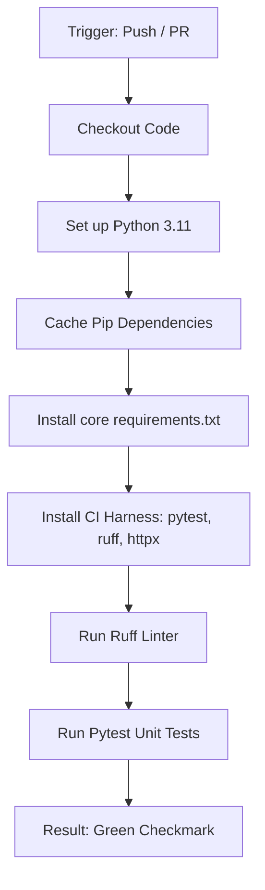

# VASIS AI — CI/CD Pipeline & Quality Assurance Documentation

This document describes the Continuous Integration (CI) and Continuous Deployment (CD) practices, local verification steps, and automated GitHub Actions workflows for **VASIS AI**.

---

## 🚀 Pipeline Overview

VASIS AI uses a automated quality assurance pipeline to ensure code health, consistency, and structural integrity. The CI/CD pipeline consists of:
1. **Local Pre-Commit Checks**: Quick commands for developer verification.
2. **Automated Linting & Code Quality**: Enforcing PEP 8 and Pythonic standards using `ruff`.
3. **Fast-Path Unit Testing**: Fast-running unit and mock tests using `pytest` that do not depend on external model servers.
4. **Production Benchmarking**: Deep execution checks (`tests/run_master_production.py`) which run offline with a local model server.

---

## 🛠️ GitHub Actions Workflow (`ci.yml`)

The automated CI pipeline runs on every **push** and **pull request** targeting the `main` or `master` branches.

* **Configuration File**: [.github/workflows/ci.yml](file:///e:/Vasis%20AI/.github/workflows/ci.yml)
* **Runner Environment**: `ubuntu-latest`
* **Target Python Version**: `3.11`

### Core Steps in the CI Workflow:



1. **Checkout Code**: Retrieves the repository contents using `actions/checkout@v4`.
2. **Setup Python**: Dynamically provisions a Python 3.11 runtime using `actions/setup-python@v5`.
3. **Dependency Caching**: Caches `~/.cache/pip` mapped to the hash of `requirements.txt` to minimize install times across builds.
4. **Core Package Installation**: Installs primary dependencies from `requirements.txt` (PyMuPDF, ChromaDB, FastAPI, etc.).
5. **CI Harness Installation**: Installs dev dependencies: `pytest`, `pytest-mock`, `httpx`, and `ruff`.
6. **Code Quality Linting**: Executes `ruff check .` to catch code style regressions, unused imports, and syntax errors.
7. **Unit Test Execution**: Runs `python -m pytest tests/ -v` to check all unit test files (`test_*.py`).

---

## 💻 Local Developer Guide

To prevent committing failing code, developers should run linting and testing steps locally before pushing changes.

### 1. Run Linter
We use `ruff` for fast and comprehensive linting.
```bash
# Run style and quality checks
ruff check .

# Automatically fix correctable errors
ruff check . --fix
```

### 2. Run Fast-Path Unit Tests
Fast-path tests verify the API routes, document ingestion architecture, and agent routing logic using mock LLM queries to avoid hitting local model servers.
```bash
# Run pytest in verbose mode
python -m pytest tests/ -v
```

### 3. Running Production Benchmarks (Local Only)
Production evaluations (like the 20-paper × 100-query benchmark) are **excluded** from the automated GitHub Actions runner because they require a local Ollama server running memory-intensive 7B models.
```bash
# Ensure your local Ollama server is running (port 11435) with qwen2.5-coder and deepseek-llm
# Run the full 100-query production suite
python tests/run_master_production.py
```

---

## 📈 Release & Deployment (CD)

Currently, the CD pipeline is configured to validate pushes to `main`. When code passes all tests:
* It is ready for manual packaging or deployment.
* The local interactive control panel can be launched safely via [start_system.bat](file:///e:/Vasis%20AI/start_system.bat).
